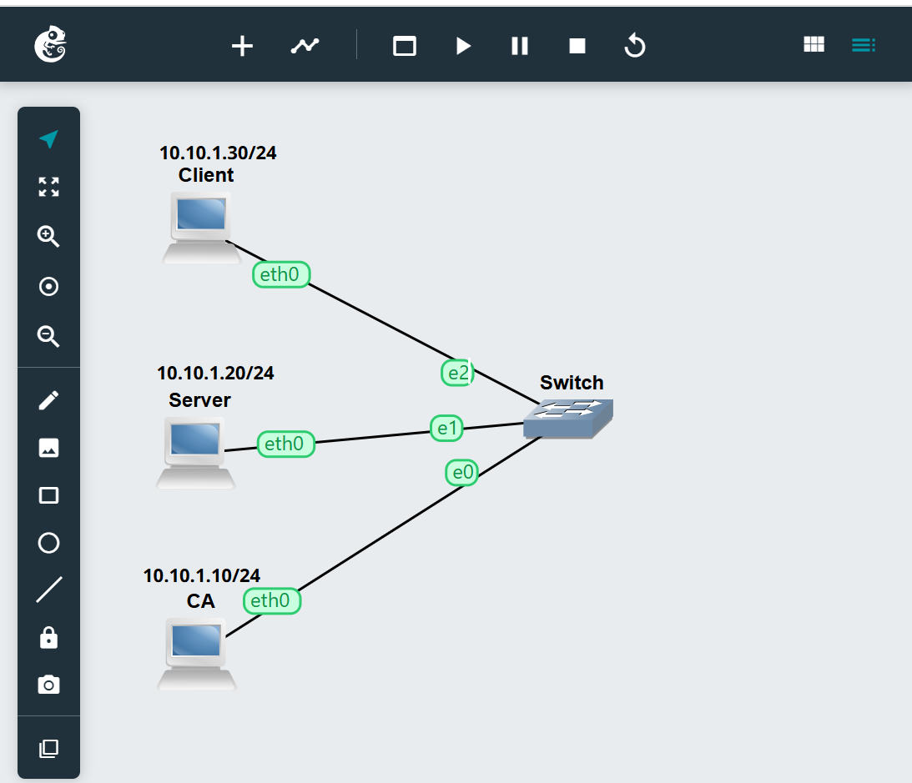
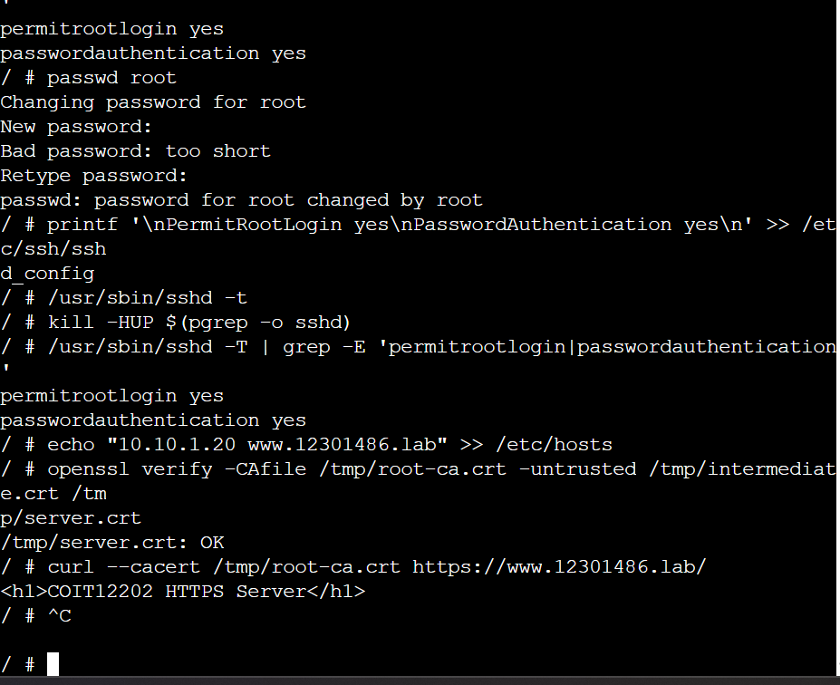
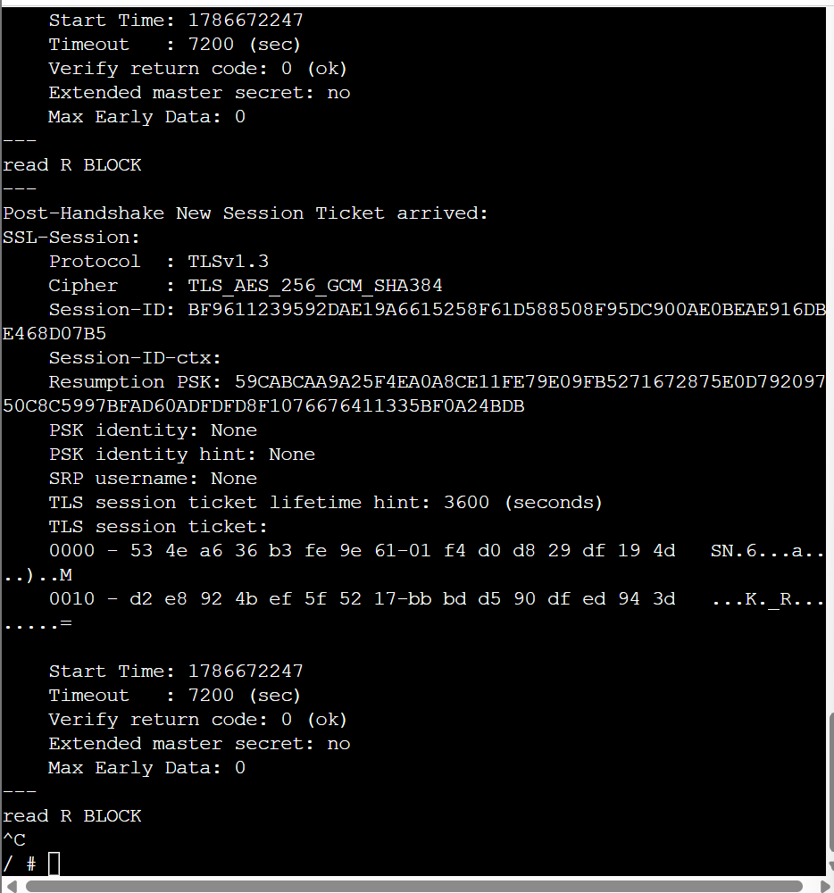
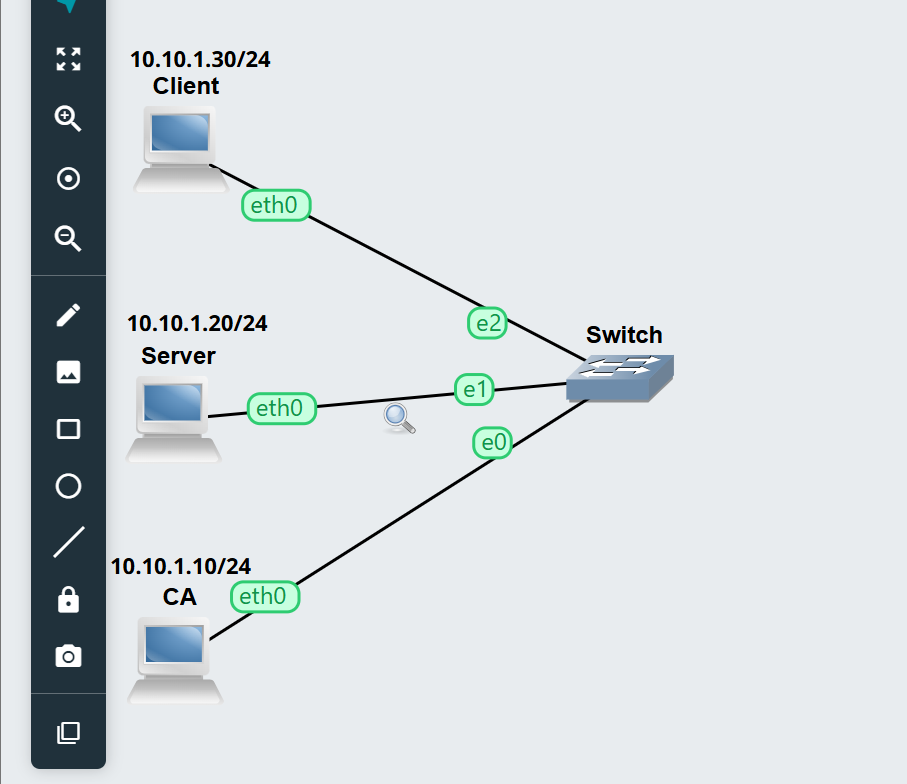

# OpenSSL CA Portfolio — Student ID 12301486

## Evidence

### Network topology

Three Linux hosts (`CA`, `Server`, `Client`) connected via a switch on the `10.10.1.0/24` subnet.

### Certificate verification and HTTPS request

`openssl verify` confirming the chain is OK, followed by a successful `curl --cacert` HTTPS request to the server.

### TLS handshake inspection (`openssl s_client`)

Output from `openssl s_client` inspecting the certificate chain and session details presented during the TLS handshake.

### Packet capture point

Capture point on the link between the switch and the `Server` host, used to capture the TLS handshake and HTTPS traffic.

## Questions

### Q1. Purpose of an intermediate CA

An intermediate CA serves as a different certificate authority amid the root CA and server certificate. The root CA provides a signature to the intermediate CA certificate, after which the latter can sign server certificates. This is considered better practice as the private key of the root CA can be kept safe from prying eyes. If the intermediate CA is breached, it can be revoked without putting the root CA private key at risk.

### Q2. What `openssl verify` checks

The command `openssl verify` is used to verify whether the server certificate is trustworthy via the chain of certificates leading to the trusted root certificate authority. The algorithm verifies the signatures and relationships in the certificate chain. Without the intermediate certificate, the client would typically not be able to build a full trust chain from the server's certificate up to the root certificate authority, causing verification to fail.

### Q3. Why application data isn't visible in the capture

Once a secured connection is formed, HTTP application data becomes safe and protected through TLS encryption. The packet capture displays only handshake information, disclosing details of the connection itself as well as the certificates. However, the actual HTTP request and response content captured in the packets is encrypted.

### Q4. Self-signed vs. CA-signed certificates

A self-signed certificate is authenticated by the entity that created the certificate instead of a recognized certificate authority. Such certificates are useful for testing or development, and in private cases where they can be trusted manually.

A CA-signed certificate is issued by a trusted certificate authority and is part of a certificate chain. Such certificates are better suited for production sites and services, since they can be verified by clients through trusted certificate authorities.

## Reflection

Working through this activity gave me a much clearer, hands-on understanding of how a certificate chain of trust is actually built rather than just knowing it in theory. Setting up the root CA and then the intermediate CA showed why organisations separate the two: the root CA's private key only needs to be touched once, to sign the intermediate certificate, and can then be stored offline, while the intermediate CA does the day-to-day work of signing server certificates. Generating the server CSR, signing it with the intermediate key, and assembling the chain file in the correct leaf-to-root order made the abstract idea of a "trust chain" concrete — it was easy to see how a wrong order or a missing certificate in the chain file would break verification on the client side.

Configuring Nginx to serve the full chain and then verifying it from the client with `openssl verify`, `curl --cacert`, and `openssl s_client` tied the exercise together. Capturing traffic on the switch-server link reinforced why TLS matters in practice: the handshake and certificate exchange were visible in the capture, but the actual HTTP request and response content was not, which is the whole point of the encryption.

## Conclusion

This activity demonstrated a complete two-tier CA hierarchy, from generating the root and intermediate keys through to issuing and deploying a server certificate and verifying the resulting trust chain end-to-end. The `openssl verify` and `curl` results confirmed that the client correctly trusted the server certificate via the intermediate CA, and the packet capture confirmed that the TLS handshake was visible while the HTTP payload remained encrypted. Overall, the exercise met the aim of building and verifying a working CA hierarchy, and it highlighted the practical reasons why intermediate CAs, correctly ordered certificate chains, and SANs are standard practice in real-world PKI deployments.
