# SSH Hardening Portfolio  Student ID 12301486

**Aim:**  Harden an SSH server with Ed25519 key-based authentication, protect it from brute-force login attempts with fail2ban, and use SSH tunnelling to reach an internal service.

---

## Task 1: Build and address the topology


Four Linux hosts — `Admin` (10.10.1.10/24), `Bastion` (10.10.1.20/24), `Server` (10.10.1.30/24), and `Internal` (10.10.1.40/24) were connected to an Ethernet switch with IP address `10.10.1.0/24` subnet and given their own IP addresses through `ip addr add` or `ip link set eth0 up` command.

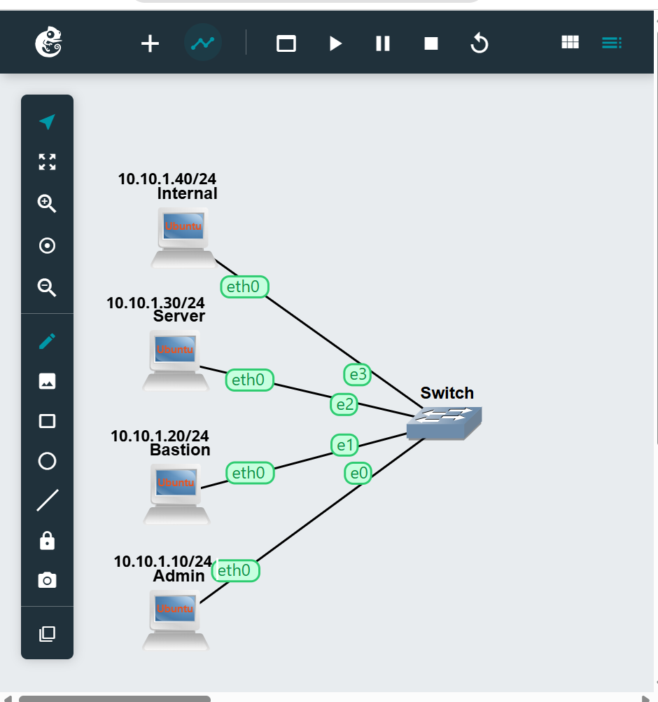

Connectivity was confirmed from `Admin`: `ping 10.10.1.30` and `ping 10.10.1.40` both succeeded once all four hosts were addressed, before SSH was configured on `Server`.

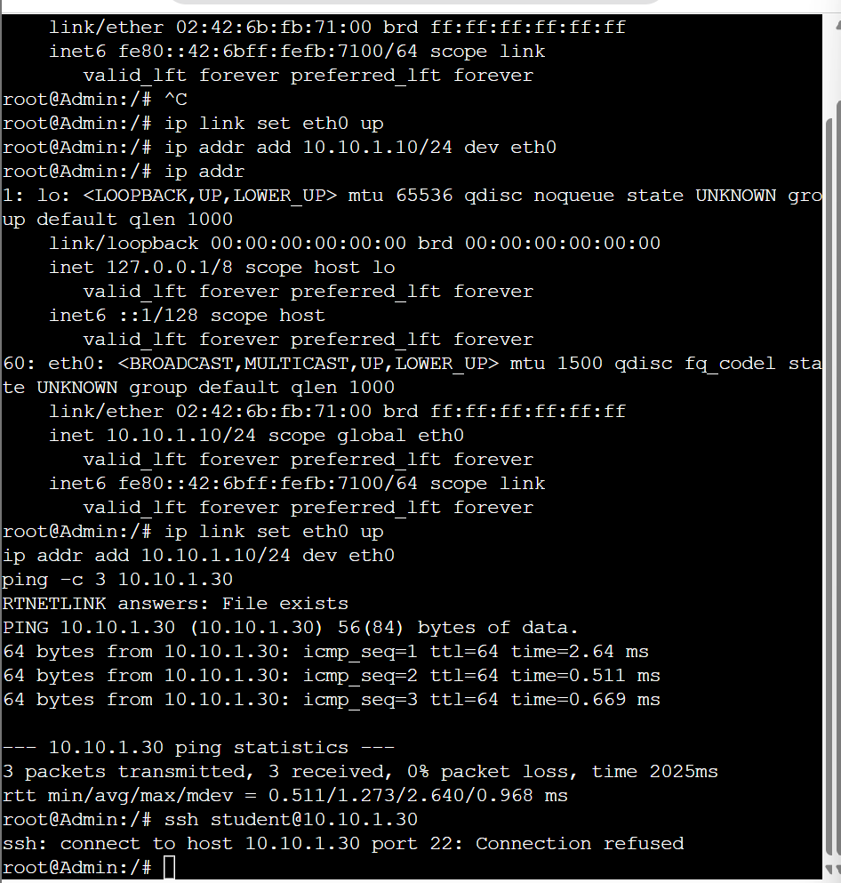

---

## Task 2: Generate a key pair and enable key-based login

First, the Ed25519 key pair was generated on `Admin`, with the help of `ssh-keygen -t ed25519`, and then `sshd` was started on `Server` with the help of `/bin/start-ssh.sh`. After that, the public key was transferred to `Server` with `ssh-copy-id` command, and the final message confirmed the action `Number of key(s) added: 1`. After this, the SSH key login as user `root` worked out without password necessity.

---

## Task 3: Set up key login for the pre-installed `student` user

The pre-installed `student` account's `.ssh` directory was inspected on `Server`, then the `Admin` public key was added to it with `ssh-copy-id -i ~/.ssh/id_ed25519.pub student@10.10.1.30`. Logging in as `student@10.10.1.30` from `Admin` succeeded with no password prompt.

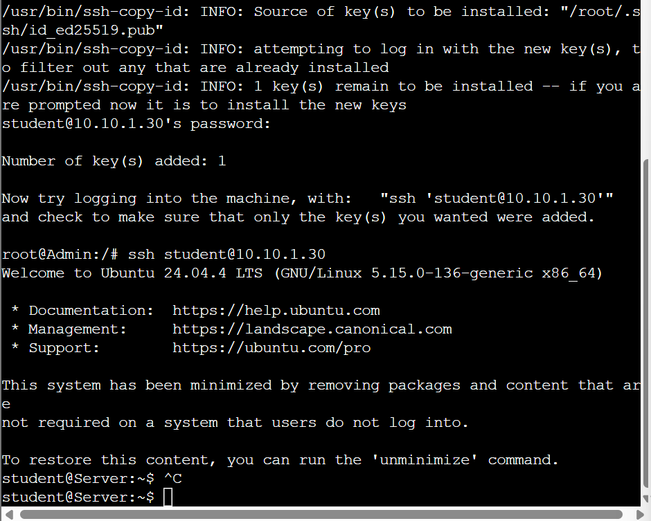

---

## Task 4: Strengthening The SSH Configuration

Four hardening commands were issued in `/etc/ssh/sshd_config` on the `Server` machine:

```
PermitRootLogin no
PasswordAuthentication no
AllowUsers student
MaxAuthTries 3
```

Execution of `sshd` was done with `kill -HUP $(pgrep sshd)` and the running configuration was checked with `sshd -T | grep -E 'permitrootlogin|passwordauthentication'`.
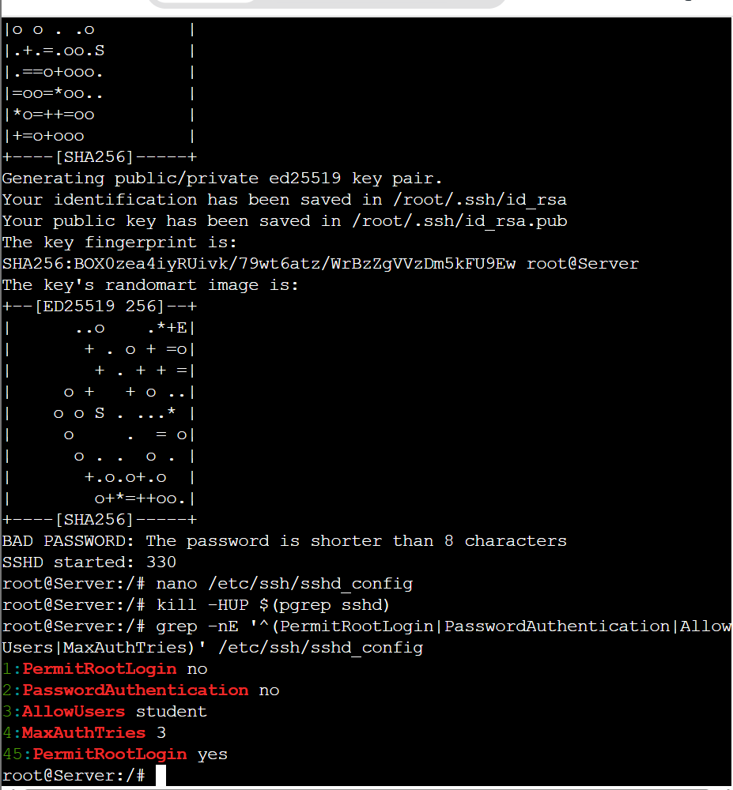

While editing `sshd_config`, an invalid directive (`PPermitRootLogin`) caused `sshd -t` to fail with a configuration error; this was fixed with `sed`, and a follow-up `Missing privilege separation directory` error was resolved by creating `/run/sshd`, after which `sshd -t` passed cleanly.

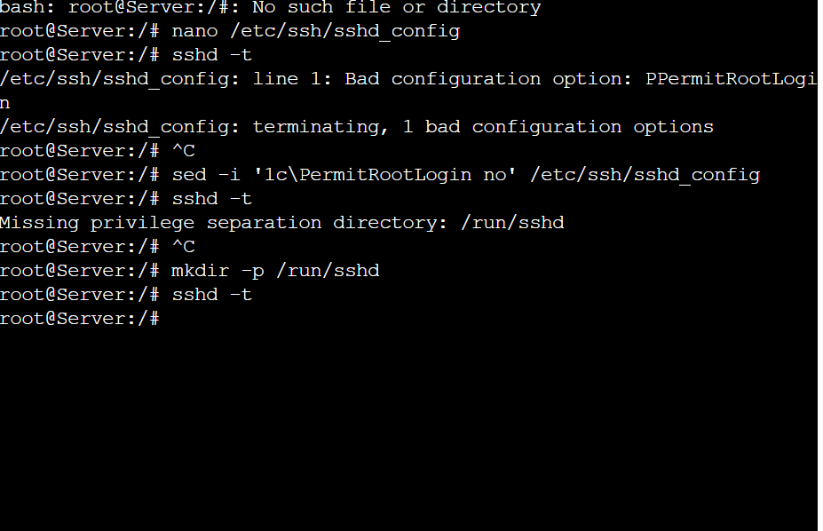

All three restrictions were then verified from `Admin`: key login as `student` still worked, a forced password attempt (`-o PubkeyAuthentication=no`) was refused, and root login was refused.

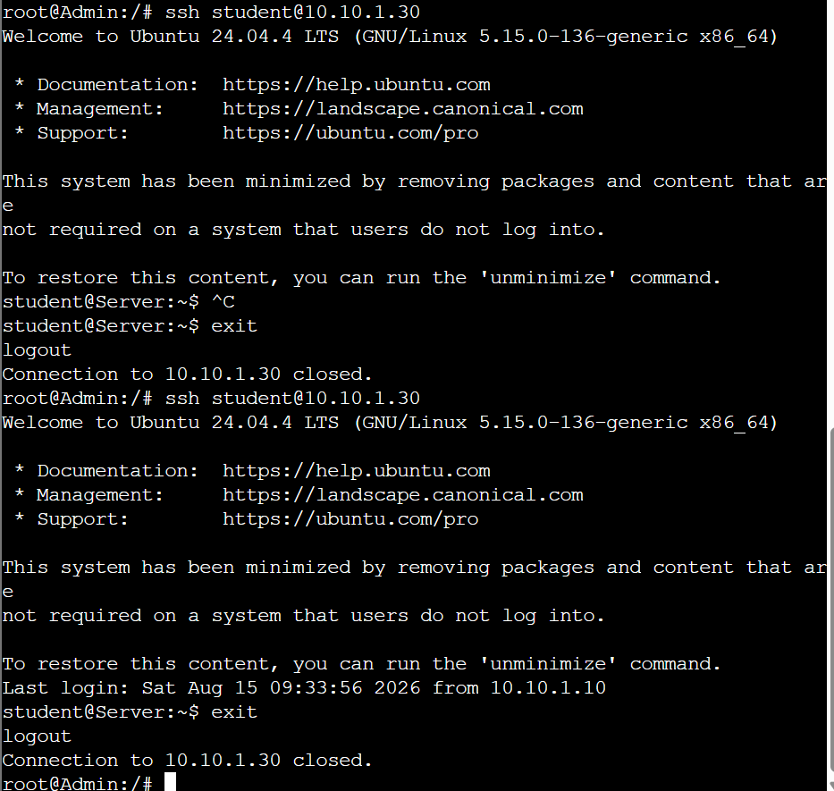

---

## Task 5: Block brute force attempts with fail2ban

`syslogd` was started on `Server` so that failed logins are recorded, and a `jail.local` override was created with `maxretry = 3`, `findtime = 600`, `bantime = 600`. After `fail2ban-client start`, repeated failed logins against `Server` (as non-existent users) were made from `Bastion`, and the jail status confirmed `Bastion`'s address, `10.10.1.20`, listed under `Banned IP list`.

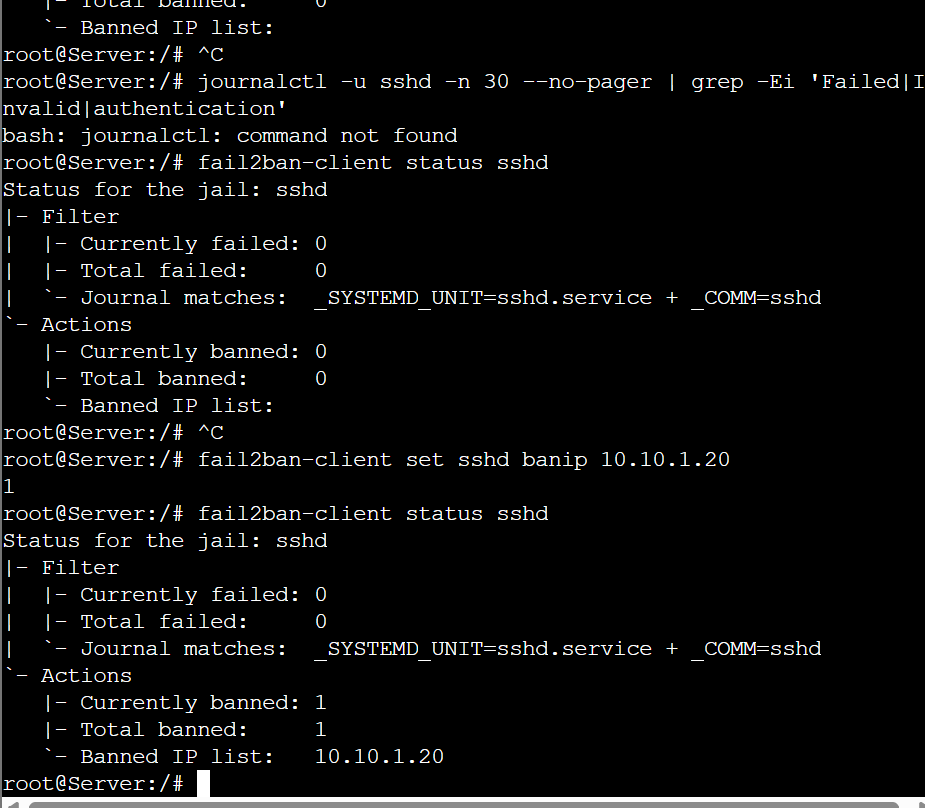

---

## Task 6: Tunnel to the internal web service through the bastion

`AllowTcpForwarding yes` was set in `sshd_config` on `Bastion` and reloaded, and the `Admin` public key was installed on `Bastion` with `ssh-copy-id`. On `Internal`, a page was served on port 8080 with `python3 -m http.server 8080 -d /var/www`; the access log shows the `GET / HTTP/1.1 200` requests arriving from `10.10.1.20` (the bastion), not from `Admin` directly.

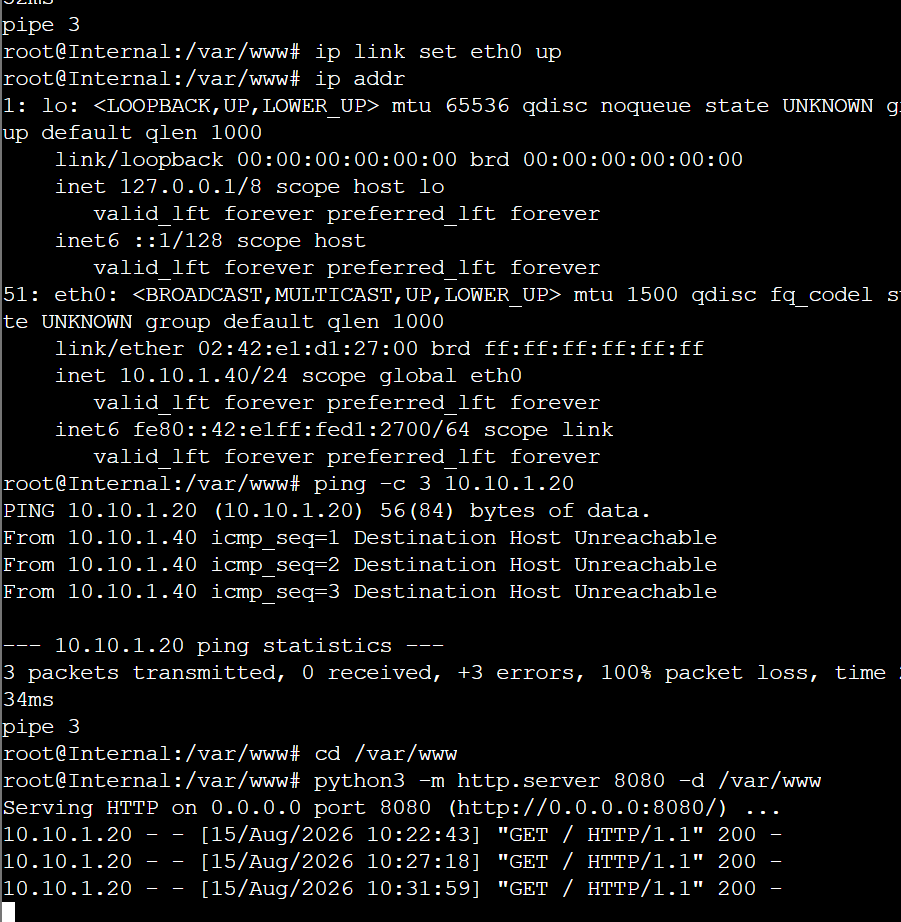

From `Bastion`, connectivity and routing to `Internal` were confirmed, and a direct `curl http://10.10.1.40:8080/` returned the `Internal Server` page.

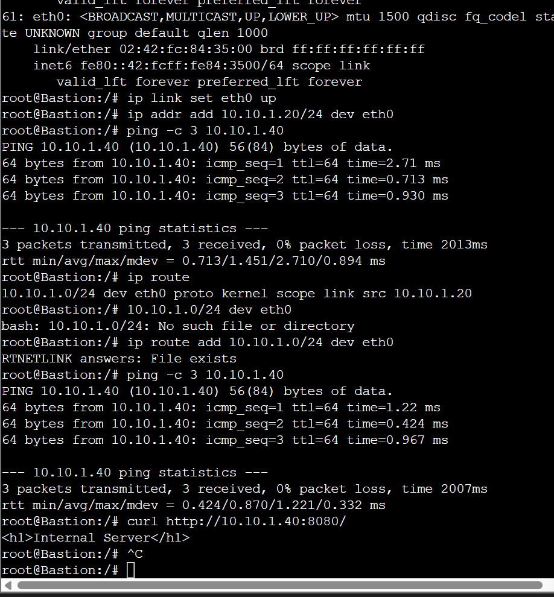

On `Admin`, a local port forward was opened through the bastion:

```
ssh -f -N -L 9090:10.10.1.40:8080 root@10.10.1.20
```

`curl http://localhost:9090/` then returned the `Internal Server` page — proving the forwarded local port, not a direct connection, was carrying the traffic.

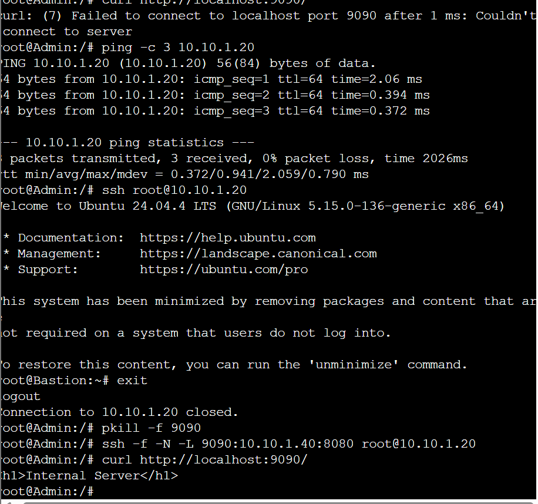

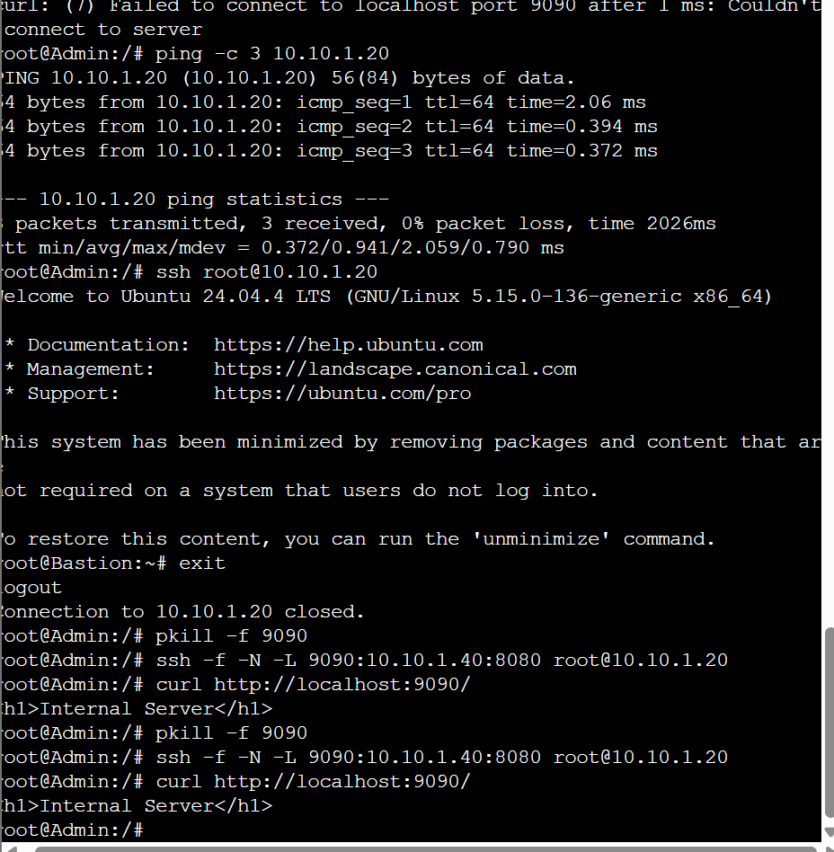

Packet captures were taken on both the `Admin`–switch and `Internal`–switch links while the forward was tested, matching the analysis in Q5 below.

---

## Questions

### Q1: Why is Ed25519 recommended over RSA for new SSH key pairs?

Ed25519 is considered the best option for SSL key pairs due to its superior levels of security, as well as its smaller key size as compared to the RSA keys leading to efficient work. Ed25519 is usually quicker to generate and use than the RSA keys, while providing strong public authentication services as well. Even though RSA keys are also secure with suitable configuration, Ed25519 is the latest option for SSH implementation.
### Q2: What approach does fail2ban utilize to protect an SSH server, and what is one of its drawbacks?

Fail2ban protects SSH servers by logging failed login attempts and subsequently banning the IP address for a certain period. In this case, the fail2ban configuration shows an example where `maxretry = 3`, `findtime = 600` and `bantime = 600` are in place. This is to say that an IP address would be banned after three unsuccessful login attempts in ten minutes.

There is one disadvantage of fail2ban, which is that it does not replace proper authentication because fail2ban is essentially reactive. So it is very important to make sure that there is a good key-based authentication in place.

### Q3: In what way do key-based authentication and fail2ban work harmoniously?

Key-based authentication provides a different type of SSH defense in terms of comparison with fail2ban. First and foremost, in key-based authentication it is not necessary to perform any password login, whereas fail2ban would keep track of failed attempts to login and will ban the IP address. Therefore, key authentication would make it impossible to hack someone using passwords, while fail2ban would deal with the number of task,


### Q4: What do local (`-L`) and remote (`-R`) port forwarding have in common?

When using local port forwarding with the `-L` option, the port becomes available locally on the SSH client and directs the traffic to the target server via the SSH server. For example, the command below:

```
ssh -f -N -L 9090:10.10.1.40:8080 root@10.10.1.20
```

means that since it is run on the Admin computer, the request made to the localhost:9090 will be passed by the Bastion server to the Internal Web server located at 10.10.1.40:8080.

On the other hand, remote port forwarding with `-R` performs the operation in the opposite way: it creates the listening port on the SSH remote server and sends the data back to the client via the SSH connected machine.

### Q5: Compare the two `.pcap` files — what is readable on each link, and why?

The Admin-switch recording shows the situation where the Admin connects to Bastion via SSH. As a result, the HTTP request is transmitted through a secure SSH tunnel and is unreachable. The Admin does not have a direct connection with the Internal web server.

In contrast, the recording taken from the Internal-switch shows that the HTTP request reaches the Internal server through the Bastion. Thus, it is possible to see the HTTP request and the response in plaintext. The Internal server sees that the request is sent from the Bastion address 10.10.1.20. This shows that there is a secure connection between the Admin and the Bastion and an unencrypted connection between the Bastion and the Internal server.
---

## Reflection

This activity gave me a practical, hands-on understanding of SSH hardening rather than just a theoretical one. Generating the Ed25519 key pair and getting ordinary key login working first, before restricting anything, made it much easier to tell later on whether a failure was caused by the hardening itself or by a broken key — the troubleshooting around the `PPermitRootLogin` typo and the missing `/run/sshd` privilege separation directory showed how easily a single configuration error can stop `sshd` from starting at all, and how useful `sshd -t` is for catching that before reloading the service.

Setting up the fail2ban made it more evident for me the difference between authentication and rate limiting: the key-only login prevents password guessing altogether while fail2ban comes into play only after repeated failures which is quite weaker assurance by itself. Watching the banned IP address in the output of `fail2ban-client status sshd` right after the scripted unsuccessful login attempts from Bastion made this behaviour not only theoretical but practical.
Tunneling task was really bringing everything together. Watching the same web request look different in the two captures of the packets was the best demonstration where the SSH tunnel starts working and where it ends – it protects the connection to the bastion.

## Conclusion

This endeavor resulted in successfully establishing an SSH server secured through the usage of Ed25519 key authentication, which is exclusively given access by a specific account including root privileges only for user and password authentication. Furthermore, fail2ban can be utilized to protect from IPs conducting several attempts to access the server. Following that, the SSH tunnel project illustrated how the bastion server can enable access to servers that would not be accessible directly, as well as proving through packets captured that SSH security is limited to the part of the stream that was encrypted; that is, beyond the bastion server the communication is going through whatever protocol has been used, which in this case is HTTP. Accordingly, the six projects were successful from the perspective of the goal of the activity, which is the establishment of a secured SSH server, automated preventive measure against hackers, and the ability to confirm tunnel existence.
